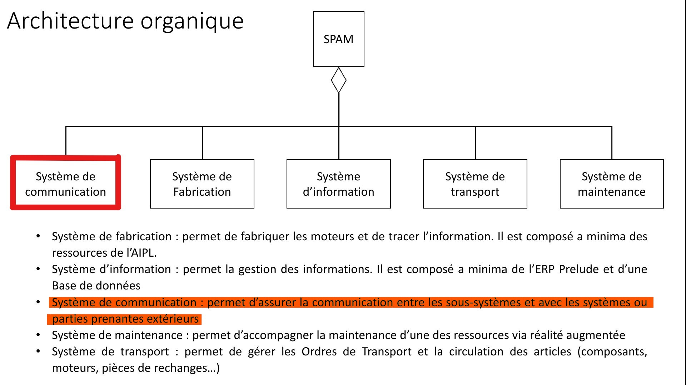
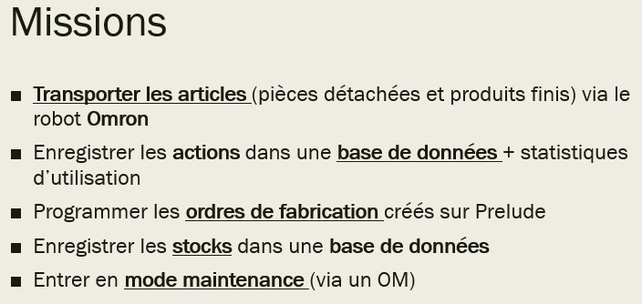

# Interface Homme-Machine pour Robot

**💡 Contexte :** SPAM - Sous-système de communication   
**🎯 Objectif :** Développer une interface interactive pour contrôler et programmer un robot  
**🛠 Technologies :** Java • Cameo Systems Modeler   
**👥 Auteur :** Jules Terlez   
**🏫 Université de Lorraine** – Projet universitaire - Master Ingénierie des Systèmes Complexes  

---

## ✨ Aperçu rapide

💡 **SPAM (Système de Production Autonome de Moteurs)** : Système composé de 5 sous-systèmes.  
  Ce projet a été réalisé en groupe. Ma partie porte sur le **sous-système de communication**.
  

  
Voir l'architecture du SPAM

   
  

  
🎯 Le SPAM a pour objectif de produire de façon autonome des moteurs.  
  

  
Voir les missions du système de communication

   
  

🛠 Conception du système de communication :
  1. Ingénierie des exigences  
  2. Création de la base de données
  3. Codage en Java

📊 Résultats ici

---

## Présentation finale
Télécharger le Powerpoint :  
- /assets/Sous-système de communication.pptx

---

## Visuels

---

## Compétences utilisées
- **Langage** : Java
- **Outils** : JavaFX (pour l'interface graphique), MariaDB (base de données), Cameo System Modeler
- **Technologies** : Commande de robot, Interface Homme-Machine (IHM)

## Documentation
[En savoir plus sur la conception de l'IHM ici](lien_vers_article).
