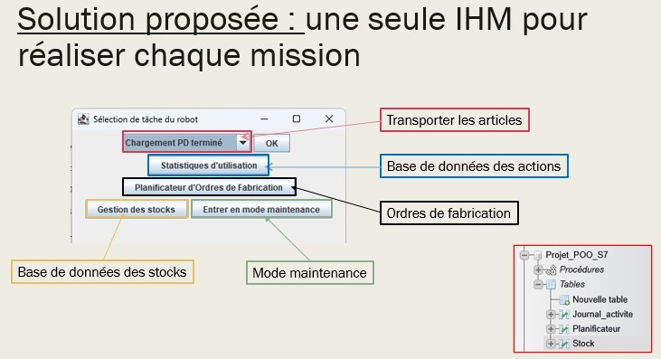
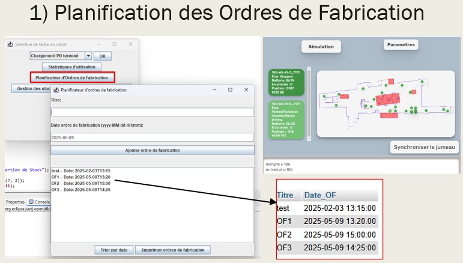
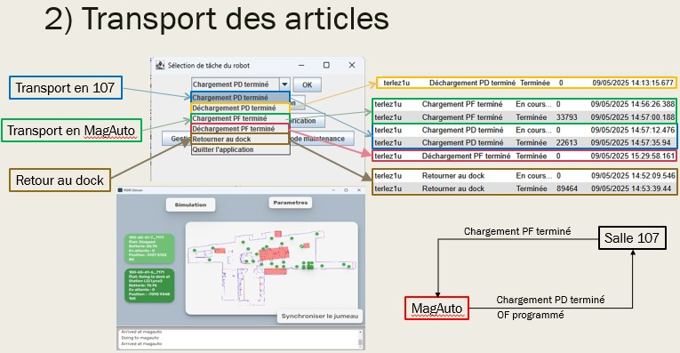
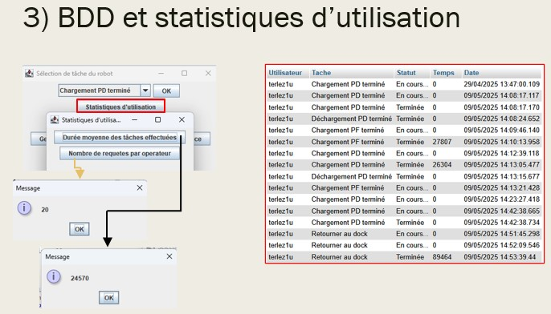
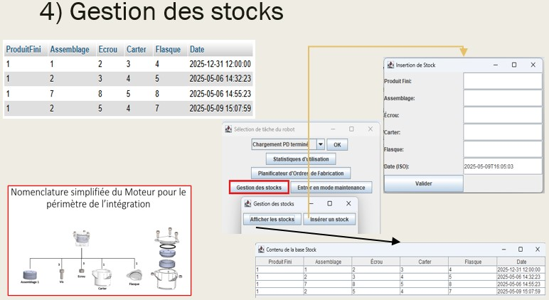
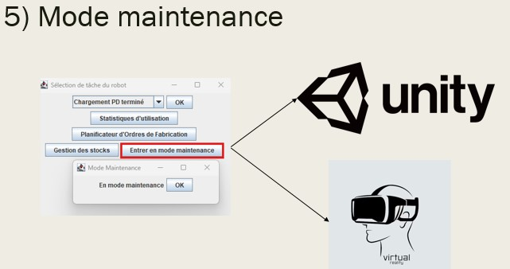
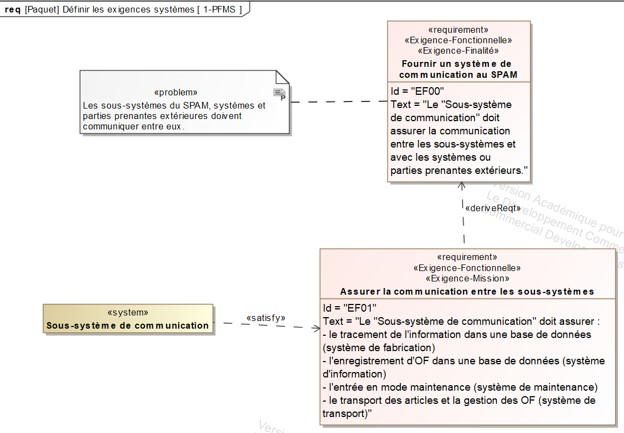
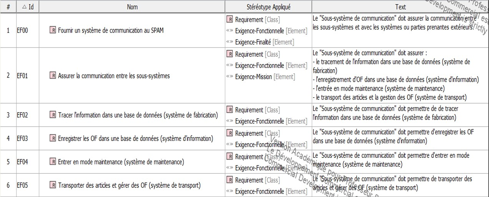

# Interface Homme-Machine pour Robot mobile

**💡 Contexte :** SPAM - Sous-système de communication   
**🎯 Objectif :** Développer une interface interactive pour contrôler et programmer un robot mobile  
**🛠 Technologies :** Java  • MariaDB • Cameo Systems Modeler   
**👥 Auteur :** Jules Terlez   
**🏫 Université de Lorraine** – Projet universitaire - Master Ingénierie des Systèmes Complexes  

---

## ✨ Aperçu rapide

💡 **SPAM (Système de Production Autonome de Moteurs)** : Système composé de 5 sous-systèmes.  
  Ce projet a été réalisé en groupe. Ma partie porte sur le **sous-système de communication**.
  

  
Voir l'architecture du SPAM

   
  

  
🎯 Le SPAM a pour objectif de produire de façon autonome des moteurs.  
Le **système de communication** doit :  
1. Contrôler et programmer les tâches d'un robot mobile. 
2. Gérer une base de données (actions, tâches, stocks)
  

  
Voir les missions du système de communication

   
  

🛠 **Conception** du système de communication :
  1. Ingénierie des exigences  
  2. Création de la base de données
  3. Codage en Java

📊 Résultats [ici](lien)  

---

## Présentation finale
Voir/Télécharger le Powerpoint :  
- /assets/Sous-système de communication.pptx

---

## Visuels

  
Voir détails

  

   
    
  <em>Figure 1 - Planification des Ordres de Fabrication</em>
       
    
  <em>Figure 2 - Transport des Articles</em>
       
    
  <em>Figure 3 - BDD et Statistiques d'utilisation</em>
       
    
  <em>Figure 4 - Gestion des Stocks</em>
       
    
  <em>Figure 5 - Mode Maintenance</em>
  

---

## Compétences utilisées
- **Langage** : Java, SQL
- **Outils** : JavaFX (pour l'interface graphique), MariaDB (base de données), Cameo System Modeler

---

## Documentation

  
En savoir plus sur la conception de l'IHM

  

   
    
  <em>Figure 1 - PFMS</em>
           
    
  <em>Figure 2 - Exigences</em>
 

---

## Exécuter le code
1. Identifiez-vous sur un **ordinateur de l'[AIPL](https://aip-primeca.univ-lorraine.fr/)**
2. Démarrez le **serveur** (demandez au professeur/référent du cours)
3. Suivez ce tutoriel [ici](lien)

4. 
5. Lancez l'application : Espace commun pédagogique > aipl > partages > M1ISC > admin > Modelisation& POO > PIDRappSansLive
6. Téléchargez le **jar externe** (/assets/mysql-connector-j-9.0.0.jar) et placez-le à la racine "O:" (Espace personnel)  
7. Téléchargez le projet et dézipper-le dans le dossier de votre choix : **Mon_dossier** (par défaut C:\Users\nom_utilisateur\Downloads)  
8. Ouvrez un IDE, de préférence **Eclipse**  
9. Dans Eclipse, cliquez Fichiers > Open Files from Files System > Mon_Dossier > src > POO > Sélectionner le dossier  
10. Chemin du jar  
11. Connectez-vous à Kapss'Ul, puis à MariaDB
12. Modifiez
13. Créez une nouvelle base de données Projet_POO_S7
14. Créez 3 nouvelles tables : 
