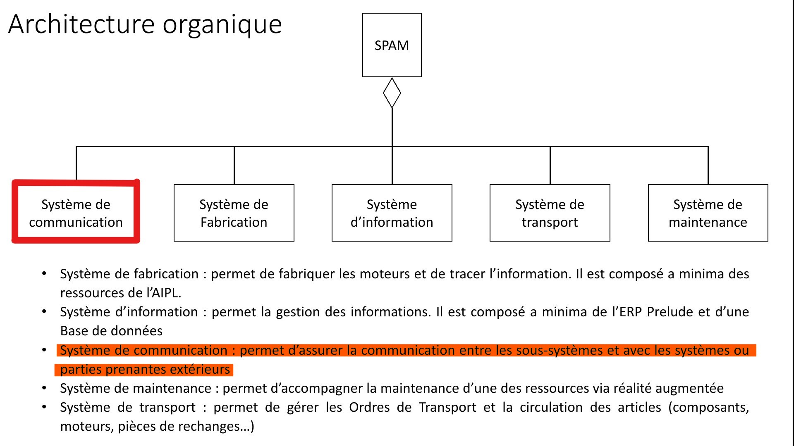

# Interface Homme-Machine pour Robot

**💡 Contexte :** SPAM : Sous-système de communication   
**🎯 Objectif :** Développer une interface interactive pour contrôler et programmer un robot  
**🛠 Technologies :** Java • Cameo Systems Modeler   
**👥 Auteur :** Jules Terlez   
**🏫 Université de Lorraine** – Projet universitaire - Master Ingénierie des Systèmes Complexes  

## ✨ Aperçu rapide

💡 **SPAM (Système de Production Autonome de Moteurs)** : Système composé de 5 sous-systèmes.  
  Ce projet a été réalisé en groupe. Ma partie porte sur le **sous-système de communication**.
  

  
📘 Voir l'architecture du SPAM

   
  

  
🎯 Le SPAM a pour objectif de produire de façon autonome des moteurs.  
  Le système de communication doit :  
  1. **Transporter les articles** (pièces détachées et produits finis) via un robot mobile  
  2. Enregistrer les actions dans une **base de données** + statistiques d'utilisation  
  3. Programmer les **ordres de fabrication**  
  4. Enregistrer les **stocks** dans une base de données  
  5. Entrer en **mode maintenance**  
  

## Compétences utilisées
- **Langage** : Java
- **Outils** : JavaFX (pour l'interface graphique), MariaDB (base de données), Cameo System Modeler
- **Technologies** : Commande de robot, Interface Homme-Machine (IHM)

## Capture d'écran

## Documentation
[En savoir plus sur la conception de l'IHM ici](lien_vers_article).
